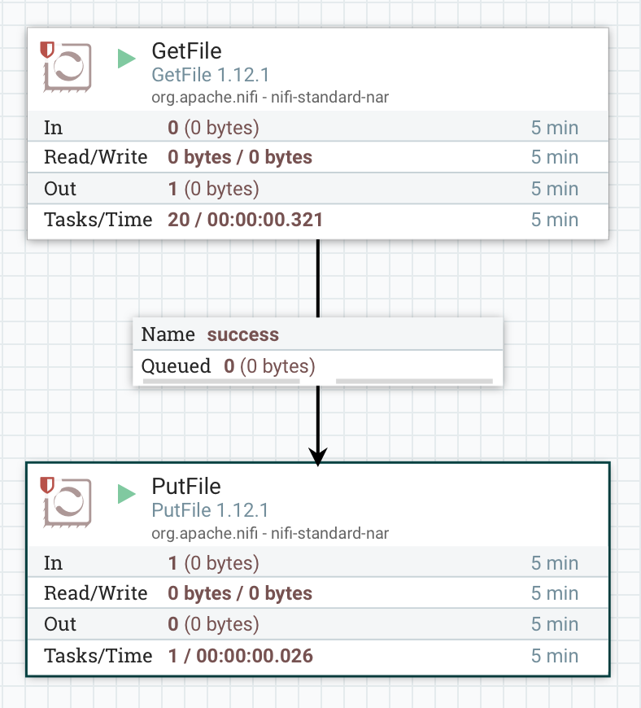

# Building your first Data Flow

In this exercise we will create our first NiFi workflow:

File --> NiFi --> File

It will be a guided exercise, while explaining the different concepts by the teacher.

Only setup required is to create the two directories inside NiFi's docker container:

```shell
# Check the container ID
$> docker ps

CONTAINER ID        IMAGE                         COMMAND                  CREATED             STATUS              PORTS                                                   NAMES
0aa0fd637286        apache/nifi-registry:latest   "/bin/sh -c ${NIFI_R…"   3 minutes ago       Up 3 minutes        0.0.0.0:18080->18080/tcp, 18443/tcp                     nifiregistry
712682af2ec6        apache/nifi:latest            "../scripts/start.sh"    3 minutes ago       Up 3 minutes        8000/tcp, 8443/tcp, 10000/tcp, 0.0.0.0:8080->8080/tcp   nifi

# Get into the container (select the container ID for "nifi")
$> docker exec -it 712682af2ec6 /bin/bash

# Create two directories
$> cd /tmp
$> mkdir in
$> mkdir out
```

Now follow the steps as the teacher explains it.

# Resources

* Apache NiFi (local): http://localhost:8080/nifi
* Apache NiFi Documentation: https://nifi.apache.org/docs.html

# Solution

NiFi workflow:

Move files from **/tmp/in** to **/tmp/out**


