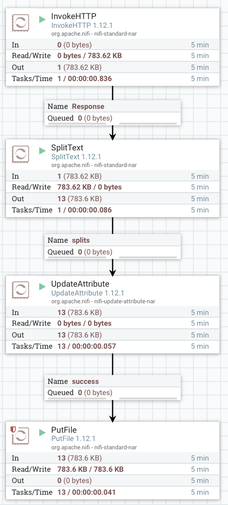

# Basic Ingestion (II)

In this exercise we will get "batch data" from an open data source and store into HDFS, performing some "data preparation":

HTTP service --> NiFi --> File

# Details

In this exercise we will not only move data (from HTTP to /tmp/out), but also do some basic transformations:

* Split the file, using the **SplitText** processor
  * Split every 1000 rows
* Rename the file, using the **UpdateAttribute** processor
  * Example renaming: `EDEM-${filename}-${nextInt()}.txt`

# Resources

* Apache NiFi (local): http://localhost:8080/nifi
* Apache NiFi Documentation: https://nifi.apache.org/docs.html
* Apache NiFi Expresion Language Guide: https://nifi.apache.org/docs/nifi-docs/html/expression-language-guide.html 
* Data Source: http://gobiernoabierto.valencia.es/es/resource/?ds=textos-calles&id=975c7bd7-7eef-4201-b8a2-3bdc45b0906e

# Solution

- Scheduled to get the data each 30 seconds.
- Line split count of SplitText: 1000 rows

  

