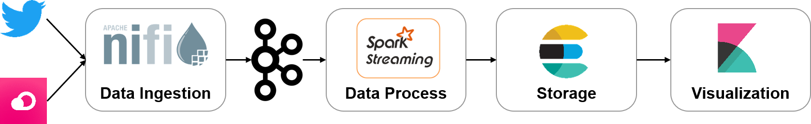

# Implementing a Streaming Complete Architecture

Purpose of this architecture is to perform a realtime stock prices analytics. In order to achieve that, implemented architecture is able to ingest, process and analyze in real time stock prices and tweets speaking about those companies. 
Here you have the Architecture:



* As you can see we use two data sources
    * [IEX Cloud](https://iexcloud.io/)
    * [Twitter](https://developer.twitter.com/)
* We implement following data pipeline
    * Data Ingestion in Nifi and Kafka
    * Data processing with Spark Streaming
    * Data Storage on Elasticsearch
    * Data visualization on Kibana

## Infrastructure Setup

In order to **launch** the required infrastructure you just have to go to the "docker" folder and run the following:

```
docker-compose -f docker-compose-complete-architecture.yml up -d
```

## Configure and connect different pieces:

### Elasticsearch mapping

* Access to Kibana (http://localhost:5601)
* Go to Dev Tools and execute the following query and Create mapping for latestUpdate field on quotes index
```
PUT quotes
{
  "mappings": {
    "properties": {
      "latestUpdate": {
        "type": "date" 
      }
    }
  }
}
```

### Nifi workflow

* Access to Nifi (http://localhost:8090/nifi/)
* Load template available on Nifi folder. 
* On Nifi workflow configure the following
	* On GetTwitter box, configure your twitter development Consumer Key, Consumer Secret, Access Token and Access Token Secret.
	* On three invokeHTTP boxes, configure API url adding your production token of IexCloud. Also, chande the url -> *sandbox* to *cloud*
* Launch all the boxes, and monitor that there are not errors raised. 

### Spark Streaming

* Open Jupyter Notebook (http://localhost:8888)
* Upload Notebook Stream processing Complete Architecture
* Follow the steps to launch two streaming pipelines for data transformation and storage on Elasticsearch

### Kibana visualization

* Go to Kibana, and create two index patterns, one for twitter and other for quotes data, remember to select latestUpdate as the timestamp field. 
* Create two visualization Panes over quotes index (remember to Save the visualization for every pane)
	* Create a Line Visualization to show price evolution of Google Company (remember to Save the visualization).
	* Add a Pie Chart to show sum of latestVolume for every company

* Create two visualization Panes over twitter index (remember to Save the visualization for every pane)
	* Create TagCloud based on entities.hashtags field selecting 10 most common hashtags
	* Add a Data Table over twitter index with the 10 most active users (Selecting aggregation over user.name.keyword)

* Finally integrate four panes on a Dashboard (Go to Dashboard Section and select your previous panes)
	
