# ELK Stack

## Infrastructure Setup

In order to **launch** the required infrastructure you just have to go to the "docker" folder and run the following:

```
docker-compose up -d
```

## Nutrition Demo

On this demo we will play with a nutrition dataset that you can take a look on following link [Nutrition dataset](../docker/data/nutrition/nutrition.csv)

1. Now open a web browser and enter on [Kibana](http://localhost:5601). And we will create a dashboard with the folowing
* Total number of products of the dataset.
* Pie chart with top5 brands containing products.
* Table with top 5 calorie products.
* TagCloud with ingredients more common.

Here you can see a screenshoot 

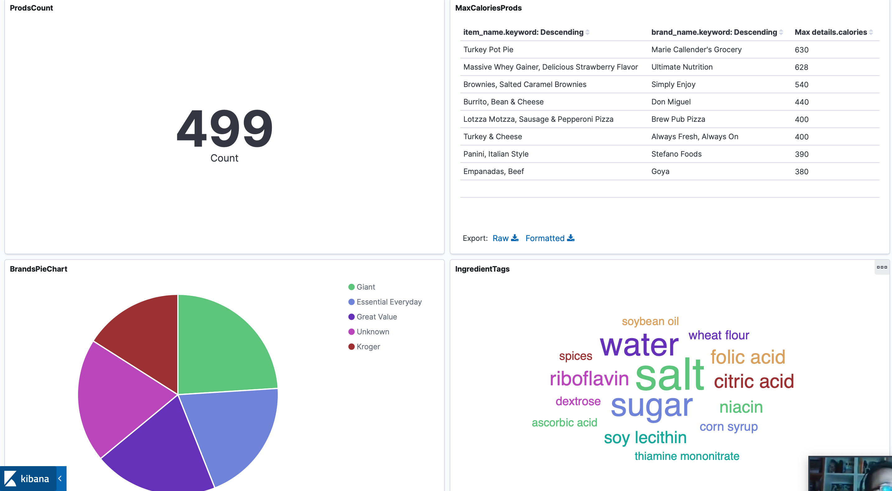


## EXERCISES

[Elasticsearch](#1.-elasticsearch)

[2. Logstash](#2.-logstash)

[3. Kibana](#3.-kibana)

## 1. ELASTICSEARCH

**Objective**: you will see how quickly and easily the Elastic Stack can be used to search a dataset. You will startup Elasticsearch and Kibana, then run queries from Kibana to search an indexed dataset.

*Note*: The datasets we are going to use are on the following folder: ../docker/data

* Launch docker compose with full ELK stack

  ```
  cd ../docker
  docker-compose up -d
  ```

* Open your Web browser and go to http://localhost:9200.

**Response:**

```json
{
  "name" : "elasticsearch",
  "cluster_name" : "docker-cluster",
  "cluster_uuid" : "SHsA7iQDQYKvnHnYzZvMcQ",
  "version" : {
    "number" : "7.3.0",
    "build_flavor" : "default",
    "build_type" : "docker",
    "build_hash" : "de777fa",
    "build_date" : "2019-07-24T18:30:11.767338Z",
    "build_snapshot" : false,
    "lucene_version" : "8.1.0",
    "minimum_wire_compatibility_version" : "6.8.0",
    "minimum_index_compatibility_version" : "6.0.0-beta1"
  },
  "tagline" : "You Know, for Search"
}
```

* Based on previous output:
    * What is the version of Elasticsearch instance? ***7.3.0***
    * What is the name of your node? ***elasticsearch***
    * What is the name of your cluster? ***docker-cluster***

* Analyse the dataset we are going to use (data/products). The dataset you are going to be using is a collection of products sold in stores. The fields in the dataset consist of:
    * grp_id: a unique ID for each row
    * upc12: a 12-digit string containing the Universal Product Code
    * brandName: the name of the company that makes the product
    * productName: the name of the product
    * customerRating: an integer value between 1 and 5, where 5 is the highest rating
    * price: a float value representing the price of the product
    * quantitySold: an integer value representing the number of units

Small sample of what the data looks like:
```
20,204040000000,Usda Produce,Plums Black,3,1.39,68603
21,753950001954,Doctor's Best,Doctor's Best Best Curcumin C3 Complex 1000mg Tablets - 120 Ct,2,1.75,651857
22,016000288829,Betty Crocker,Betty Crocker Twin Pack Real Potatoes Scalloped 2 Pouches For 2 Meals - 2 Pk,2,4.22,527899
23,070670009658,Reese,Reese Mandarin Oranges Segments In Light Syrup,2,3.73,104348
24,688267084225,Smart Living,Smart Living Charcoal Lighter Fluid,5,3.20,637769
25,044100117428,Hood,Hood Latte Iced Coffee Drink Vanilla Latte,5,5.99,166777
```

* The products dataset was indexed already into your Elasticsearch instance. Go to http://localhost:9200/_cat/indices?v. Your products index should appear in the list of indices. (Notice the size may vary, but it should contain 110,435 documents):

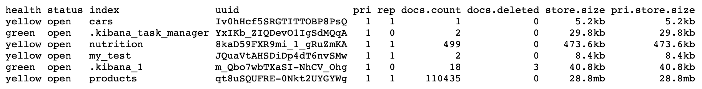

* To view the products data, use the Search API with the following URL: http://localhost:9200/products/_search. You should see 10 products (10 is the default search size). The products displayed will likely vary from the output below, but notice the output is not very pretty:

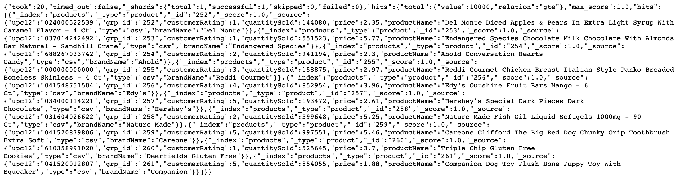

* Change the URL to include the pretty argument: http://localhost:9200/products/_search?pretty. The output should now look much nicer:

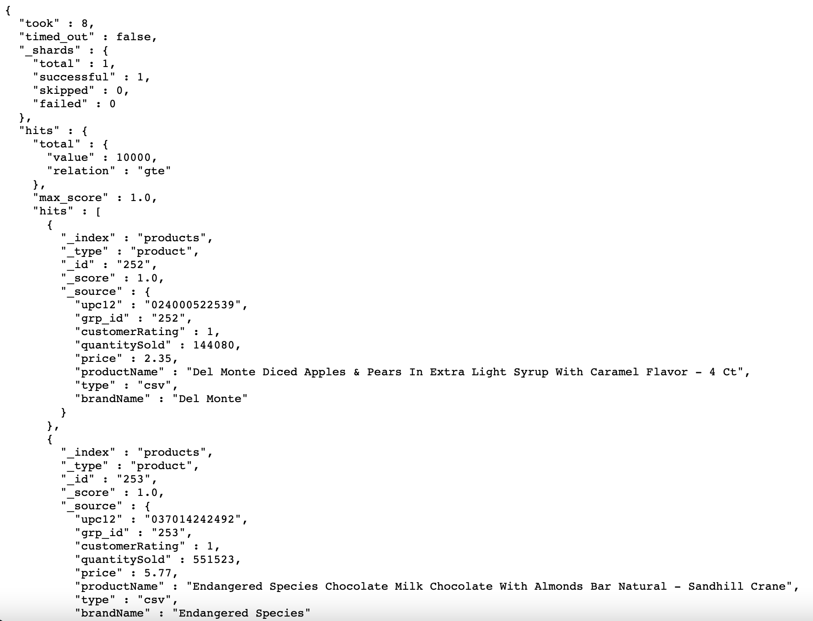

* Based on the output of previous search:
    * How many documents were indexed? ***At least 10k. The relation "gte" tells us that the number of documents are Greater or Equal than 10k***
    * What is the _type of each document? ***"product"***


### Kibana

Next, you are going to use Kibana. To verify Kibana is running, open your Web browser and go to http://localhost:5601. The Kibana application should appear.

* Click on the Dev Tools button (left side tool icon) in the side navigation pane to open the Console application.

    * Notice there is a match_all query already written in the Console. Go ahead and run it by clicking the green "play" button that appears to the right of the command, or using the Ctrl/Cmd + Enter keyboard shortcut. This search hits all documents in all indexes of your cluster. Notice the output is similar to the output you saw a few minutes ago, but displayed nicely in the Console screen.

* Now let's search for products. Enter the following query into the Console, just below your first command. It answers the question "Which products have peanut or butter in the product name?"

  ```json
  GET products/_search
  {
    "size": 25,
    "query": {
    "match": {
      "productName": "peanut butter"
    }
    }
  }
  ```

**Response**

[full json](prods_name_peanut_butter.json)

```json
{
  "took" : 322,
  "timed_out" : false,
  "_shards" : {
    "total" : 1,
    "successful" : 1,
    "skipped" : 0,
    "failed" : 0
  },
  "hits" : {
    "total" : {
      "value" : 2011,
      "relation" : "eq"
    },
    "max_score" : 11.242394,
    "hits" : [
      {
        "_index" : "products",
        "_type" : "product",
        "_id" : "108162",
        "_score" : 11.242394,
        "_source" : {
          "upc12" : "074333470441",
          "grp_id" : "108162",
          "customerRating" : 3,
          "quantitySold" : 655728,
          "price" : 19.36,
          "productName" : "Peanut Butter Creamy",
          "type" : "csv",
          "brandName" : "Arrowhead Mills"
        }
      }
      ...
```

* Based on the results of your previous search:

    * How many products in the dataset match "peanut butter" in the product name? ***2011*** 
    * What was the max_score of the results? ***11.242394***
    * Would you say that your top results were relevant to "peanut butter"? ***Of course. All the results contain at least one of those words in the name***

* Change the term "peanut butter" to "Peanut Butter" and run the query again. What is different in the results, if anything? ***The response time of the query is much lower. BUT, this is because the former result is in caché. Elastic is NOT case sensitive***

* Run a search for "kasmati rice" in the "productName", then answer the following questions:
    * How many hits are there? ***1618***
    * What was the _score of the top hit? ***19.586052***
    * View the scores of the next few hits. Why do you think the top hit had a much higher score than all the other hits? ***The name of the top hit contains both, kasmati and rice in the name. The following results don't***

* Compare the following search to the previous ones you executed. Notice the field being searched on is now customerRating. Run the following query, which answers the query: "Find all products with a customer rating of 4".

    ```json
    GET products/_search
    {
    "query": {
        "match" : {
        "customerRating" : 4
        }
    }
    }
    ```

**Response**

[full json](prods_rating_4.json)

*Notice the score for each hit is simply 1. Why do you think all matching documents have the same score? ***All the results have a rating of exactly 4****

* Write a query that finds all products whose price field is exactly 10.00. You should get 44 hits.

  ```json
  GET products/_search
  {
    "query": {
    "match" : {
      "price" : 10.00
    }
    }
  }
  ```

* Response

  [full json](prods_price_10.json)


## 2. LOGSTASH

**Objective**: Learn Logstash basics implementing several pipelines and working with several plugins.

* First test that your logstash installation is working properly, writing on the standard input:

  ```sh
  docker exec -it logstash bash
  bin/logstash -e "input { stdin { } } output { stdout {} }" --path.data /tmp/
  ```
  * Response

    ```sh
    [2021-01-08T15:32:33,866][INFO ][logstash.agent] Successfully started Logstash API endpoint {:port=>9601}
    ```

* Create a Logstash pipeline called *my-first-pipeline.conf* to consume from the filebeat on port 5044 and write to the std output. Add following line to the output section for this: stdout { codec => rubydebug }:

  ```sh
  vi my-first-pipeline.conf
  ```

  ```sh
  # Pipeline my-first-pipeline.conf
  # Input
  input {
    beats {
        port => "5044"
    }
  }
  # Filter
  # The filter part of this file is commented out to indicate that it is
  # optional.
  # filter {
  #
  # }
  # Output
  output {
    stdout { codec => rubydebug }
  }
  ```

* Before launching it, verify that your pipeline configuration is fine.

  ```sh
  bin/logstash -f my-first-pipeline.conf --config.test_and_exit --path.data /tmp
  ```
  * Response:

    ```sh
    [2021-01-08T15:44:29,195][INFO][org.reflections.Reflections] Reflections took 136 ms to scan 1 urls, producing 19 keys and 39 values 
    Configuration OK
    [2021-01-08T15:44:30,264][INFO ][logstash.runner] Using config.test_and_exit mode. Config Validation Result: OK. Exiting Logstash
    ```

* If the configuration is fine, launch this pipeline.

  ```sh
  bin/logstash -f my-first-pipeline.conf --config.reload.automatic --path.data /tmp
  ```

* Configure a filebeat logging, first logon filebeat container in a new terminal window:

  ```sh
  docker exec --user root -it filebeat bash
  ```

* Create a filebeat config to capture and publish logs:

  ```sh
  cp filebeat.yml filebeat-training.yml
  ```

* Edit filebeat-training.yml:

  ```sh
  filebeat.inputs:
  - type: log
    enabled: true
    paths:
    - /tmp/datasets/apache_logs/logstash-tutorial-dataset.log
  
  output.logstash:
    # Array of hosts to connect to.
    hosts: ["logstash:5044"]
  ```

* Launch filebeat process:

  ```sh
  filebeat -e -c filebeat-training.yml -d "publish"
  ```

* Take a look to the logstash, you should see following events on the console:

  ```sh
  {
    	"offset" => 24464,
      "message" => "86.1.76.62 - - [04/Jan/2015:05:30:37 +0000] \"GET /style2.css HTTP/1.1\" 200 4877 \"http://www.semicomplete.com/projects/xdotool/
  \" \"Mozilla/5.0 (X11; Linux x86_64; rv:24.0) Gecko/20140205 Firefox/24.0 Iceweasel/24.3.0\"",
        "source" => "C:\\Users\\role\\Documents\\Formacion\\Introduction ELK\\course-ELK-introduction\\datasets\\apache_logs\\logstash-tutorial-datase
  t.log",
      "@version" => "1",
  "prospector" => {
        "type" => "log"
  },
          "beat" => {
          "name" => "NBVAL730",
        "hostname" => "NBVAL730",
        "version" => "6.2.3"
  },
          "host" => "NBVAL730",
          "tags" => [
        [0] "beats_input_codec_plain_applied"
  ],
  "@timestamp" => 2018-04-16T11:36:42.598Z
  }
  …
  ```

* Remove data registry (after killing filebeat) in order to repopulate log messages (/usr/share/filebeat/data/registry)

  ```sh
  rm -r /usr/share/filebeat/data/registry
  ```

* Now, that we see pipeline is working, let’s tune logstash config (in logstash terminal). We are going to update logstash pipeline using a specific filter that parses unstructured data and generates a structured json. For doing this we will use grok plugin with the following property : "message" => "%{COMBINEDAPACHELOG}" .

  ```sh
  vi my-first-pipeline.conf
  ```

  ```sh
  # Pipeline my-first-pipeline.conf
  # Input
  input {
	beats {
    port => "5044"
	}
  }
  # Filter
  filter {
    grok {
      match => { "message" => "%{COMBINEDAPACHELOG}"}
    }
  }
  # Output
  output {
    stdout { codec => rubydebug }
  }
  ```


* Modify the pipeline to index all logs on local elastic instance. Check on your local kibana instance if an index for logstash data has been created (Management --> create index pattern). You should see 101 log events loaded with proper json format.

  ```sh
  # Pipeline my-first-pipeline.conf
  # Input
  input {
    beats {
      port => "5044"
    }
  }
  # Filter
  filter {
    grok {
      match => { "message" => "%{COMBINEDAPACHELOG}"}
    }
  
  }
  # Output
  output {
    elasticsearch {
      hosts => [ "elasticsearch:9200" ]
    }
  }
  ```

  * Kibana index manager for elasticsearch

    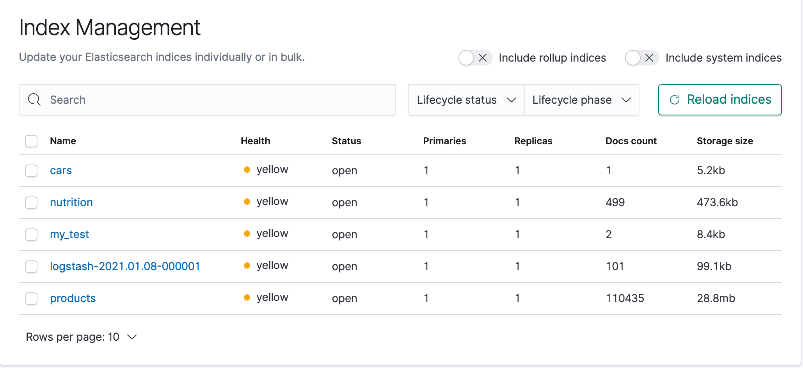

* Check the status of the logstash to see your pipeline running. You should get just one pipeline running an output similar to this. Go to this link  http://localhost:9600/_node/pipelines?pretty

 ```sh
 {
  "host" : "logstash",
  "version" : "7.3.0",
  "http_address" : "0.0.0.0:9600",
  "id" : "d6a7d999-ca44-4d0d-ac83-7f9e431b4963",
  "name" : "logstash",
  "ephemeral_id" : "097782a6-6c7a-41fb-9771-ad0720bf6784",
  "status" : "green",
  "snapshot" : false,
  "pipeline" : {
    "workers" : 2,
    "batch_size" : 125,
    "batch_delay" : 50
  },
  "pipelines" : {
    "products" : {
      "ephemeral_id" : "7e22c904-a56c-4e8d-8d61-fa8cba25428a",
      "hash" : "86b55a2860bdce9f6b36250b236ed97835fe23179253ce6601fbdf8edd6b4061",
      "workers" : 2,
      "batch_size" : 125,
      "batch_delay" : 50,
      "config_reload_automatic" : false,
      "config_reload_interval" : 3000000000,
      "dead_letter_queue_enabled" : false
    },
    "nutrition" : {
      "ephemeral_id" : "4ee01497-9ac8-4ce6-9042-d46788ec731e",
      "hash" : "06918cc754f5f71bf6e35365f55152a4d38c0bf6c70ddbb9233ed6d20d1b64e8",
      "workers" : 2,
      "batch_size" : 125,
      "batch_delay" : 50,
      "config_reload_automatic" : false,
      "config_reload_interval" : 3000000000,
      "dead_letter_queue_enabled" : false
    },
    ".monitoring-logstash" : { }
  }
 }
 ```


## 3. KIBANA

In this exercise we will play with Kibana. For that we have following datasets:

- The complete works of William Shakespeare, suitably parsed into fields GFT-EDEM-MasterData/tree/master/AlmacenamientoProcesamiento/docker/data/shakespeare). It has following schema:

  ```sh
  {
	"line_id": INT,
	"play_name": "String",
	"speech_number": INT,
	"line_number": "String",
	"speaker": "String",
	"text_entry": "String",
  }
  ```

- A set of fictitious accounts with randomly generated data (GFT-EDEM-MasterData/tree/master/AlmacenamientoProcesamiento/docker/data/accounts):

  ```sh
  {
	"account_number": INT,
	"balance": INT,
	"firstname": "String",
	"lastname": "String",
	"age": INT,
	"gender": "M or F",
	"address": "String",
	"employer": "String",
	"email": "String",
	"city": "String",
	"state": "String"
  }
  ```

- A set of randomly generated log files. fields dlp/Sessions/STO-Storage/STO-003 /docker/data/random_logs). It has a big schema, but among all the fields following ones are the important ones on the Laboratory:

  ```sh
  {
	"memory": INT,
	"geo.coordinates": "geo_point"
	"@timestamp": "date"
  }
  ```

* Before we load those data sets, we need to specify some data type mappings. To do that, go to the Dev tools on your local kibana instance (http://localhost:5601/app/kibana#/) and launch the following for Shakespeare data:

  ```sh
  PUT /shakespeare
  {
  "mappings": {
    "properties": {
    "speaker": {"type": "keyword"},
    "play_name": {"type": "keyword"},
    "line_id": {"type": "integer"},
    "speech_number": {"type": "integer"}
    }
    }
  }
  ```

  * Response:

    ```sh
    {
      "acknowledged" : true,
      "shards_acknowledged" : true,
      "index" : "shakespeare"
    }
    ```

* For logstash data, we need also to specify geopoint type mapping. Replicate this for the 3 indexes ( logstash-2015.05.18, logstash-2015.05.19, logstash-2015.05.20 ). Also check that the result is successful.

  ```sh
  PUT /logstash-2015.05.18
  {
    "mappings": {
        "properties": {
            "geo": {
                "properties": {
                    "coordinates": {
                        "type": "geo_point"
                    }
                }
            }
      }
    }
  }
  ```

* Now, let’s do a bulk load of the 3 datasets (go to the folder where data is located). Use following command as an example:

  ```sh
  curl -H "Content-Type: application/x-ndjson" -XPOST "http://localhost:9200/bank/_bulk?pretty" --data-binary @accounts.json
  ```

  * Shakespeare dataset:

    ```sh
    cd data/shakespeare
    curl -H "Content-Type: application/x-ndjson" -XPOST "http://localhost:9200/bank/_bulk?pretty" --data-binary @shakespeare_6.0.json
    ```

  * Accounts dataset:

    ```sh
    cd data/accounts
    curl -H "Content-Type: application/x-ndjson" -XPOST "http://localhost:9200/bank/_bulk?pretty" --data-binary @accounts.json
    ```

  * Random logs dataset:

    ```sh
    cd data/random_logs
    curl -H "Content-Type: application/x-ndjson" -XPOST "http://localhost:9200/bank/_bulk?pretty" --data-binary @logs.json
    ```

* Check that your created indexes exists and contains loaded data, use curl command for this.

  ```sh
  curl 'localhost:9200/_cat/indices?v'
  ```

  * Response:

    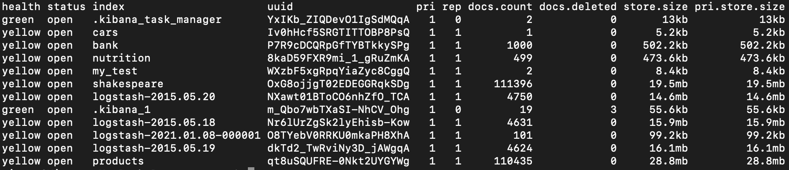
  
* Create index patterns for 3 datasets. You can use following patterns: bank*, shakespeare* and logstash-2015.05*. Take into consideration that logstash dataset contains a time series.

  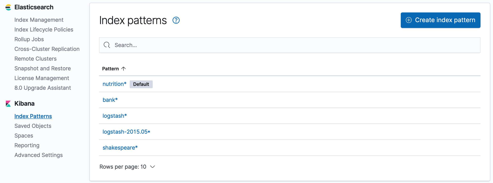


* Now, go to the discover tab and get from bank index, the accounts that have a balance higher than 47500 and the account number is lower than 100. (You should bet 5 results).

  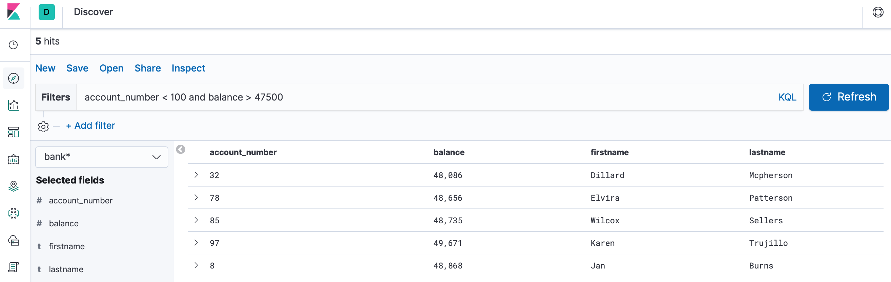

* Using Shakespeare index, get the entries that are from play “Henry IV” and on the text contains “London”. (You should get 9 hits).

  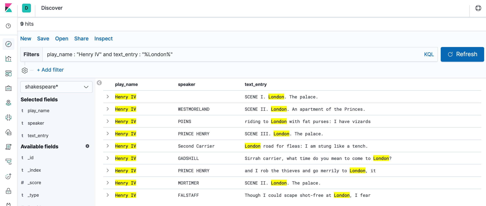

* Using account data, create a Pie chart defining following Ranges:

  | lower balance | upper balance |
  | --- | --- |
  | 0 | 999 |
  | 1000 | 2999 |
  | 3000 | 6999 |
  | 7000 | 14999 |
  | 15000 | 30999 |
  | 31000 | 50000 |

  * Solution:

    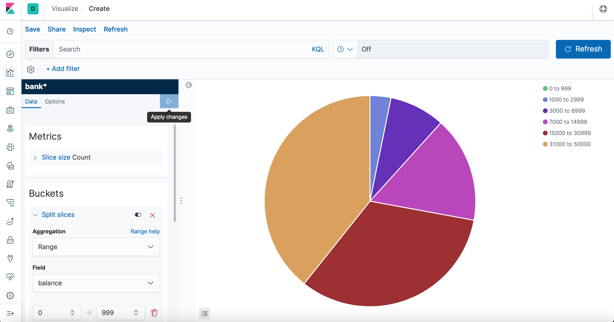

* On same Pie chart add another bucket aggregation to get the age of each account holder inside each balance range.

  * Solution:

    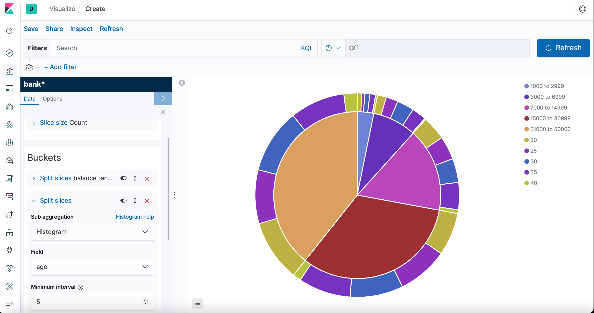

* Now let’s create a Vertical Bar Chart using Shakespeare dataset. We want to see number of speakers cast per play.

  * Solution:

    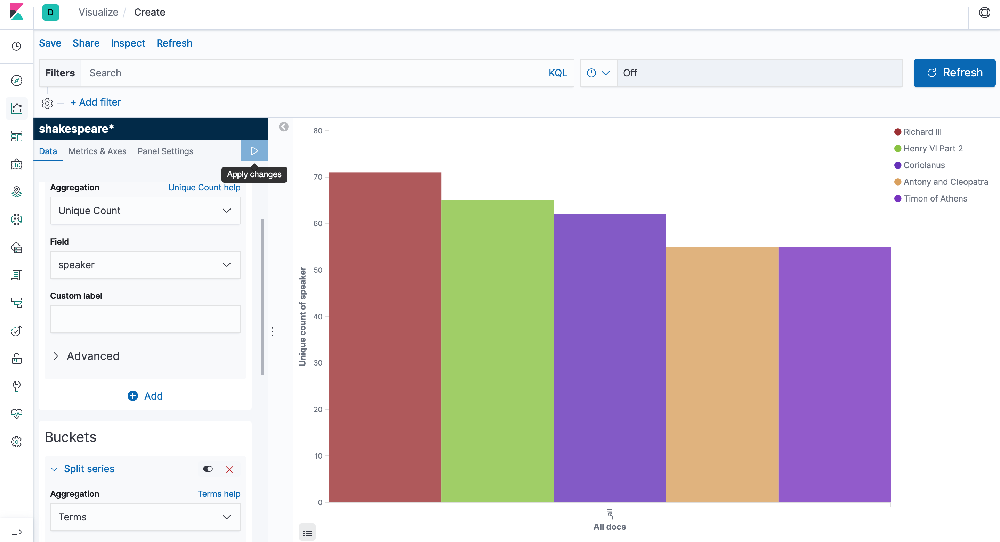

* Using same bar char, we want to get the maximum number of speeches for an individual actor on every play.

  * Solution:

    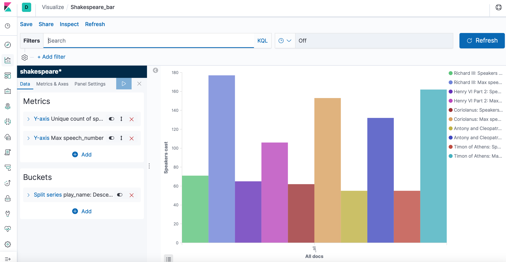


* Now, using Logstash dataset, create a Coordinate Map with following parameters:
  * Use geo.coordinates as the geo_point.
  * Configure the Time window to absolute between 18th May 2015 and 20th May 2015.

  * Solution:

    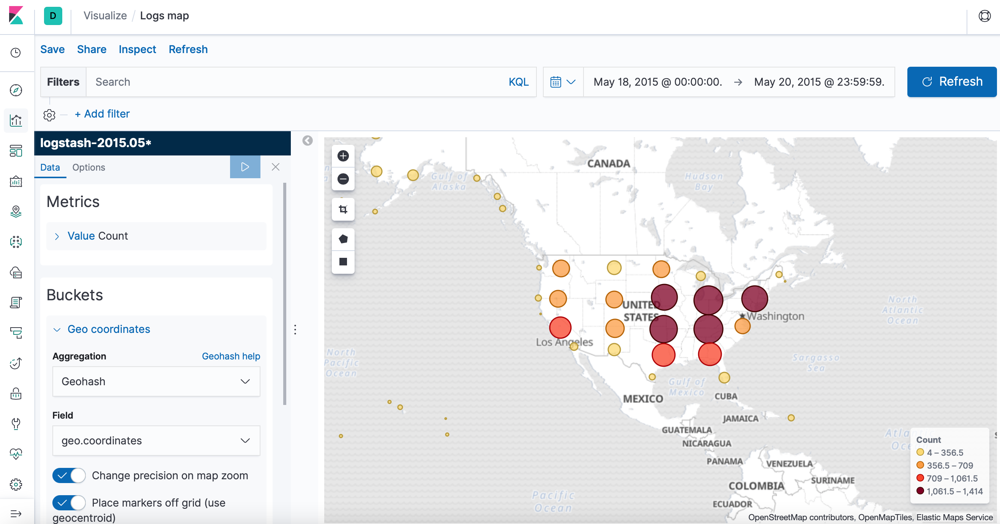


### Dashboard

Now let’s create a dashboard and integrate all visualization panes done

  * Solution:

    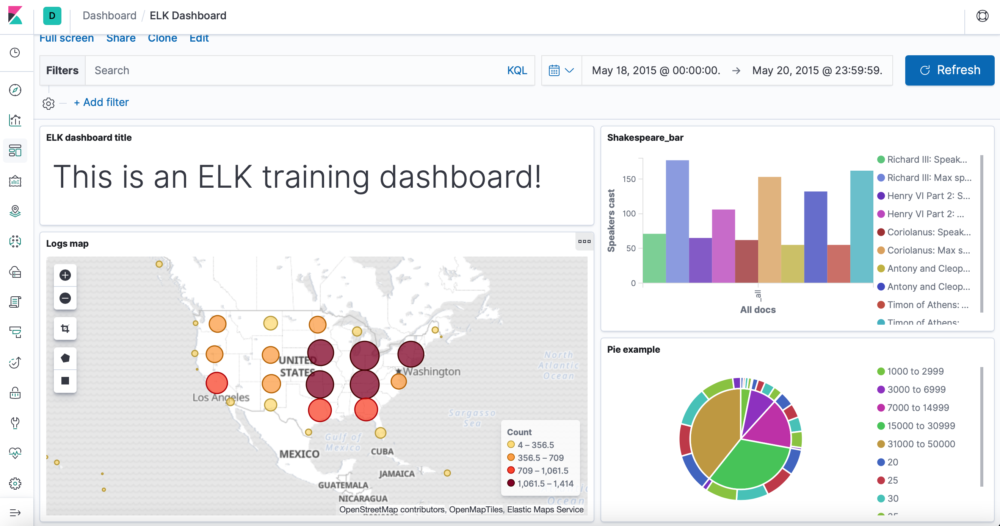
