# ETL Exercise

## Activate container with the database created in the SQL session

1) Navigate to the path where the sql docker-compose file is

2) Run the following command:

`docker-compose up -d`

3) Navigate to [localhost:5050](http://localhost:5050) (pgadmin4@pgadmin.org / admin)

## Exercise 1

### Solution

#### Read csv file: ALUMNOS.csv

#### Select and configure tFileOutputJson component

#### Final job

#### Output JSON: Sol1.json

[Sol1.json](Solutions/Sol1.json)

## Exercise 2

### Solution

#### Read csv file: Ex2.csv

#### Select and configure tReplace component

#### Select and configure tFileOutputJson component

#### Final job

#### Output JSON: Sol2.json

[Sol2.json](Solutions/Sol2.json)

## Exercise 3

### Solution

#### Connect to postgres db dvdrental

https://youtu.be/3tF_6JGIsuA

Add connection

Configure connection

Add schemas

#### Select actor table

https://youtu.be/aQlD-KURSlc

#### Select and configure tFileOutputJson component

#### Final job

#### Output JSON: Sol3.json

[Sol3.json](Solutions/Sol3.json)

## Exercise 4

### Solution

https://youtu.be/nKF2fxJYfc4

#### Select film table

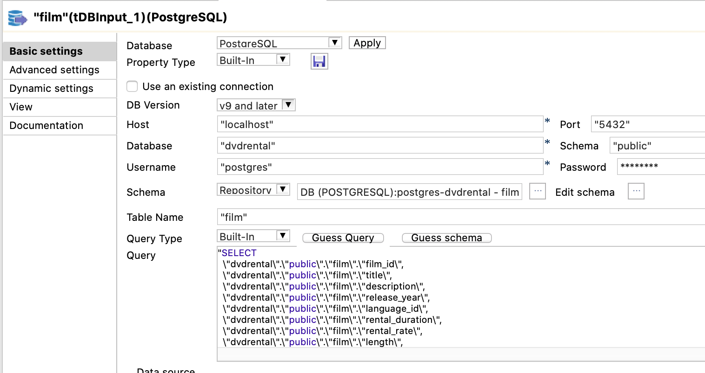

#### Add and configure tAggregateRow

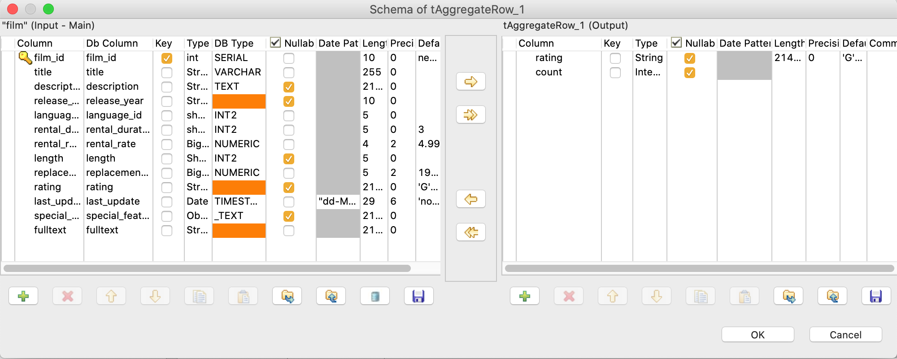

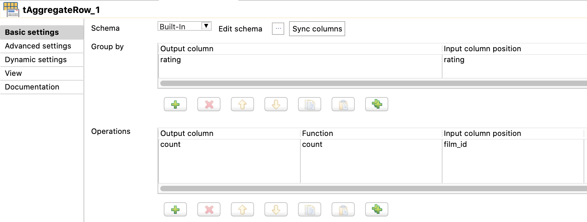

#### Select and configure tFileOutputJson component

#### Final job

#### Output JSON: Sol4.json

[Sol4.json](Solutions/Sol4.json)

## Exercise 5

### Solution

https://youtu.be/RsZqWlDTHmY

#### Final job

#### Output JSON: Sol5.json

[Sol5.json](Solutions/sol5.json)

## Exercise 6

### Solution

#### Configure tMap for joinning payment and customer tables

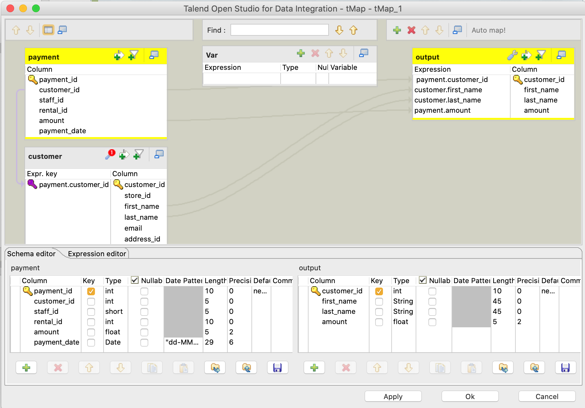

#### Configure aggregate row

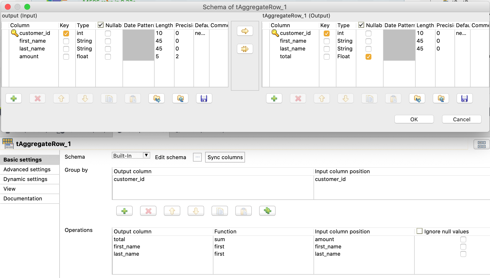

#### Configure sort row

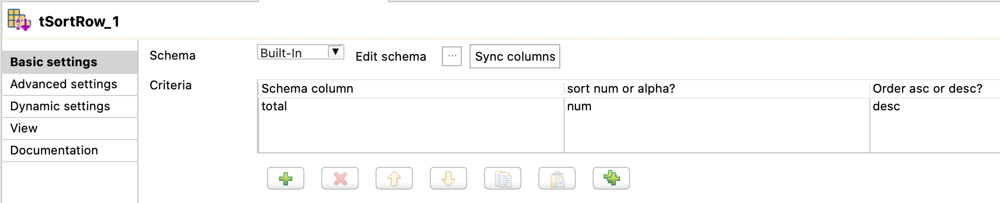

#### Select and configure tFileOutputJson component

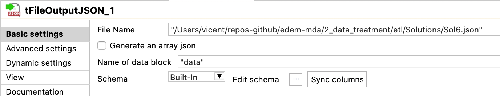

#### Final job

#### Output JSON: Sol6.json

[Sol6.json](Solutions/Sol6.json)

## Exercise 7

### Solution

https://youtu.be/vqox4KDe_0I

#### Configure tMap for joinning payment and customer tables

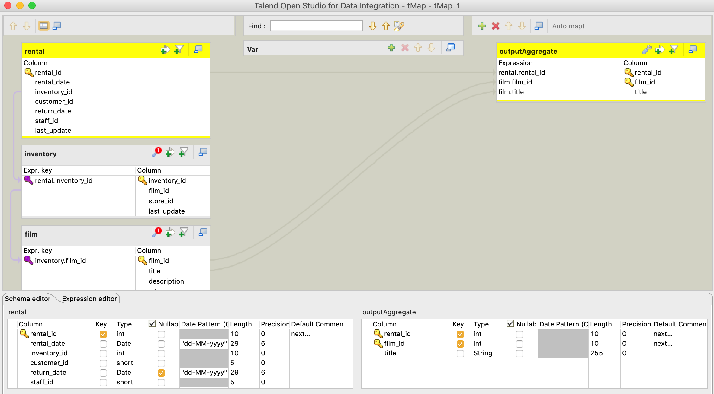

#### Configure aggregate row

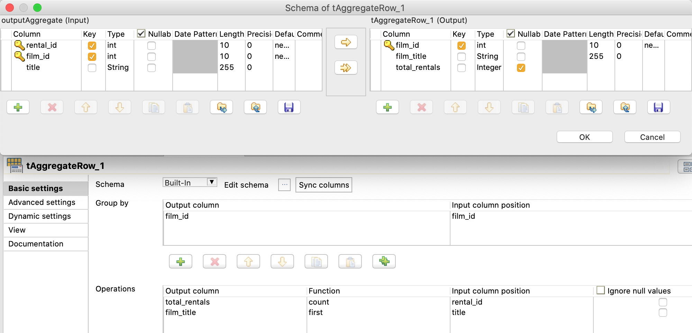

#### Configure filter row

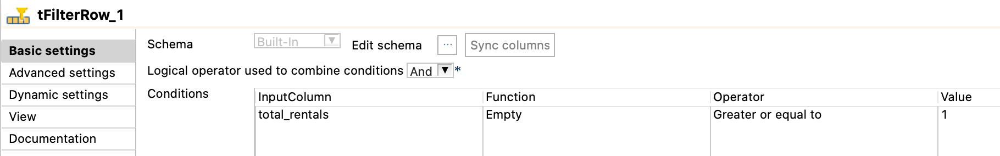

#### Configure sort row

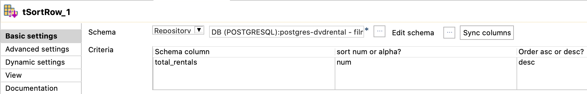

#### Configure export to table dvdrentals.film_rentals

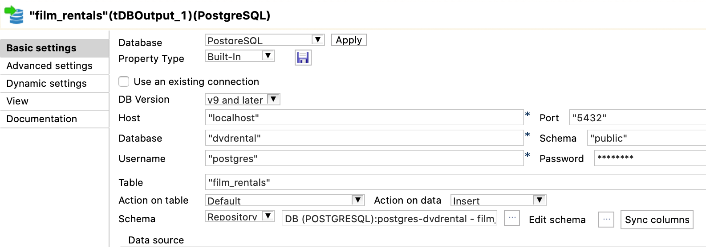

#### Final job

#### Output in dvdrentals

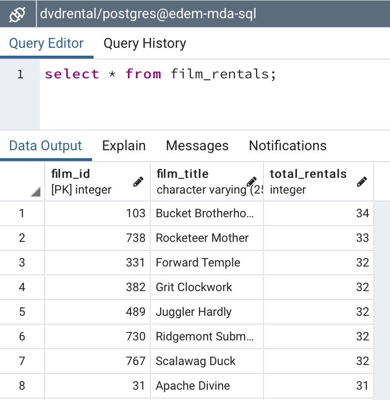

#### Check that there are no films with 0 rentals

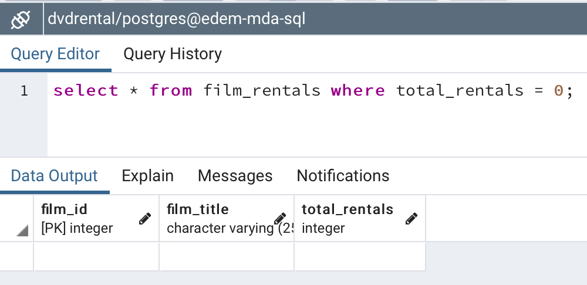

## Exercise 8

### Solution

**Create a service account in GC, register as BigQuery admin and create a key**

Follow steps of *Authenticating with Google BigQuery* in the following [link](https://www.progress.com/tutorials/jdbc/connect-and-query-google-bigquery-using-jdbc-connector)

**Select and configure tBigQueryInput**

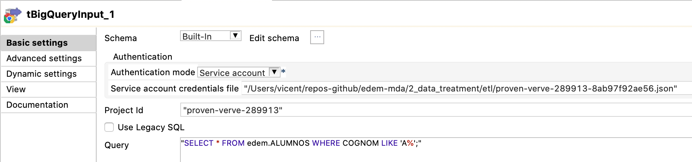

**Select and configure tFileOutputJson component**

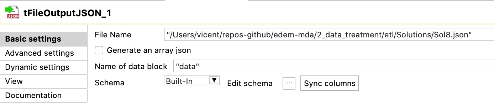

**Final job**

#### Output JSON: Sol8.json

[Sol8.json](Solutions/Sol8.json)