# ETL Exercise

## Exercise 1

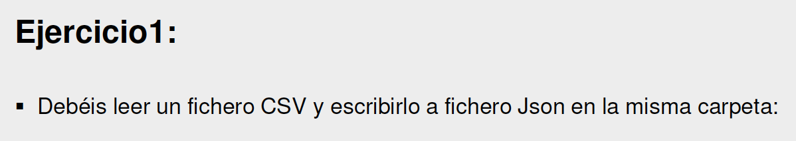

### Solution

### Read csv file: ALUMNOS.csv


### Select and configure tFileOutputJson component

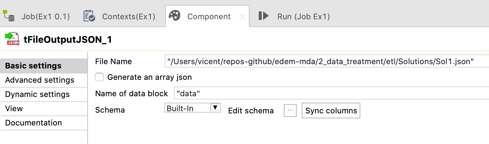

### Final job

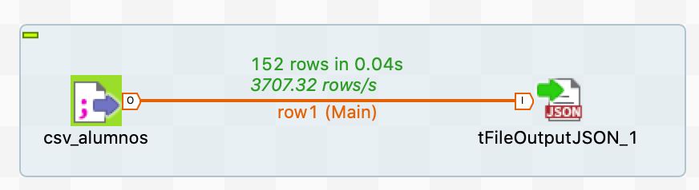

### Output JSON: Sol1.json

[Sol1.json](Solutions/Sol1.json)

## Exercise 2

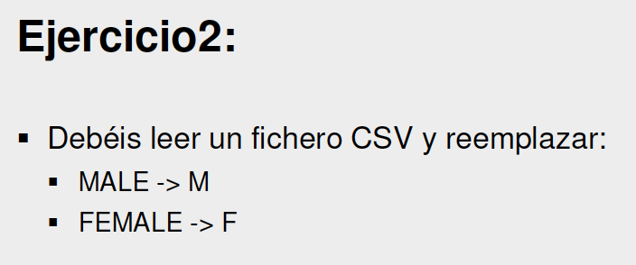

### Read csv file: Ex2.csv


### Select and configure tReplace component

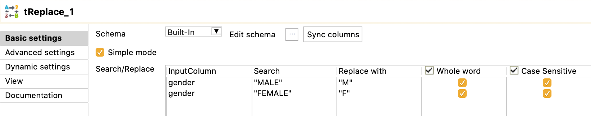

### Select and configure tFileOutputJson component

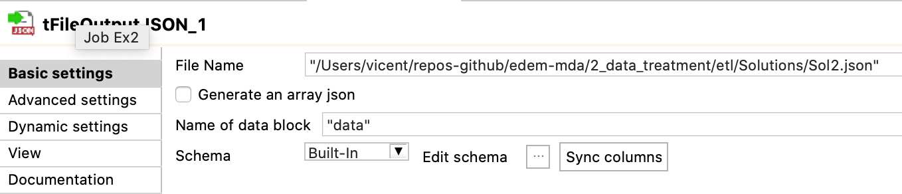

### Final job

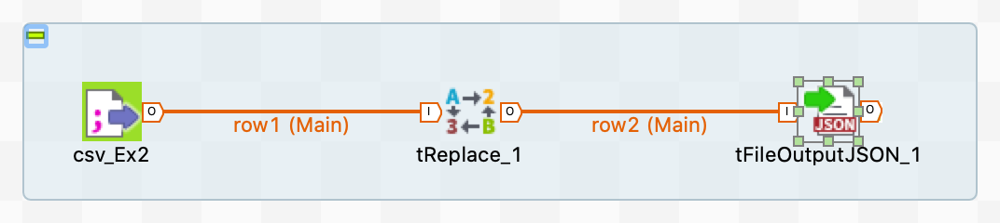

### Output JSON: Sol2.json

[Sol2.json](Solutions/Sol2.json)

## Exercise 3

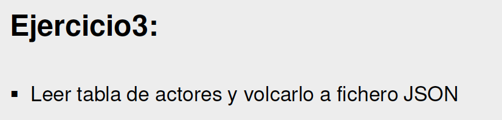

### Connect to postgres db dvdrental

https://youtu.be/3tF_6JGIsuA

Add connection

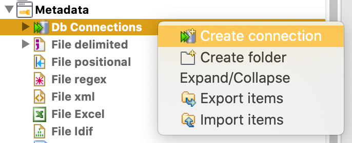

Configure connection

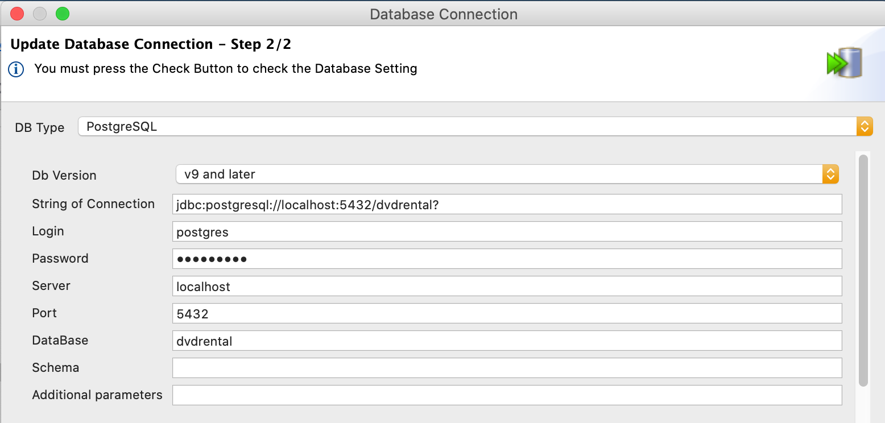

Add schemas

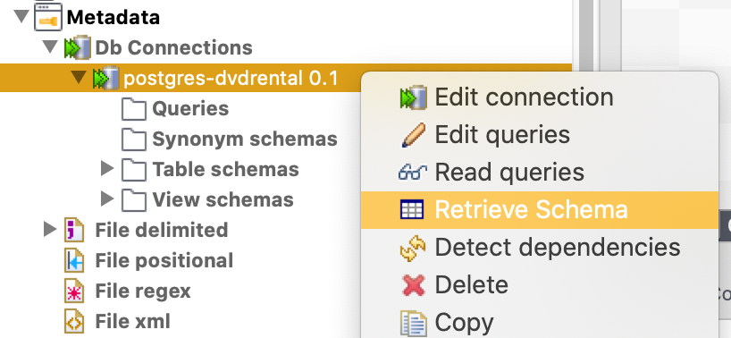

#### Select actor table

https://youtu.be/aQlD-KURSlc

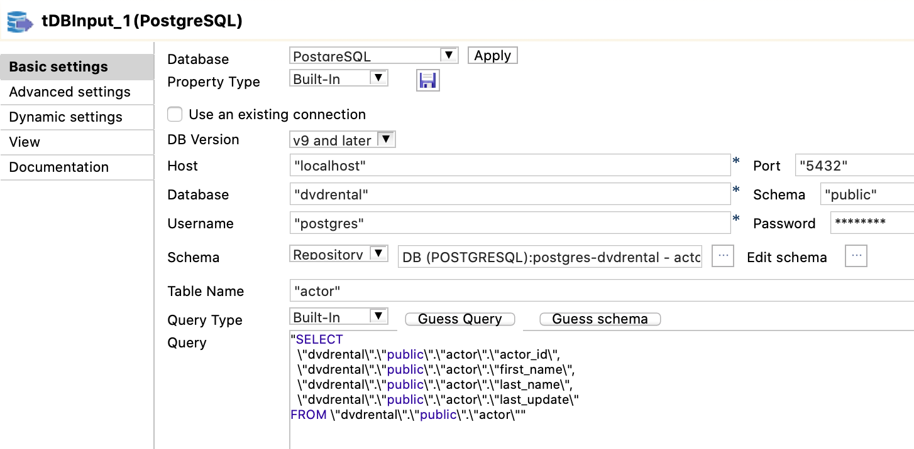

#### Select and configure tFileOutputJson component

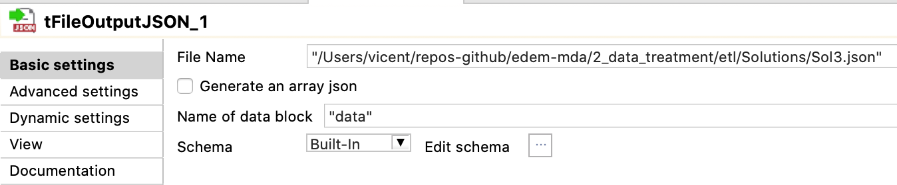

#### Final job

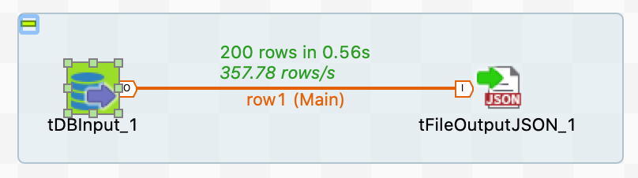

#### Output JSON: Sol3.json

[Sol3.json](Solutions/Sol3.json)

## Exercise 4

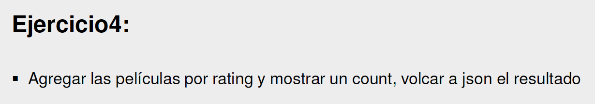

### Solution

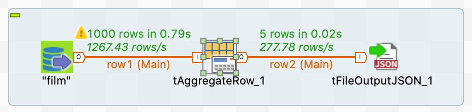

```json

```

## Exercise 5

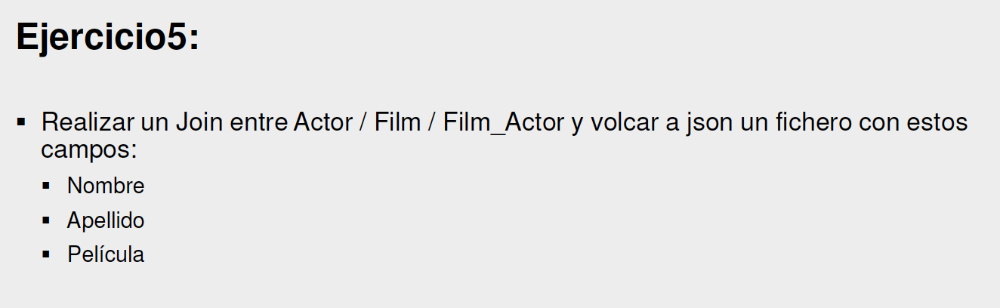

### Solution


```json

```

## Exercise 6

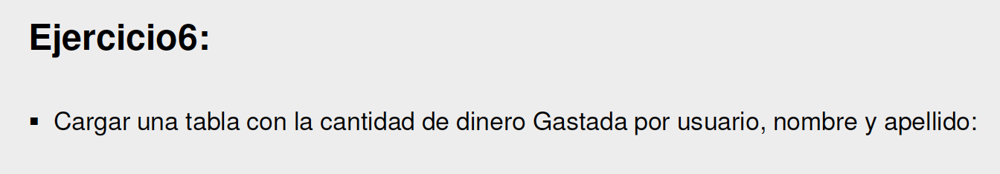

### Solution

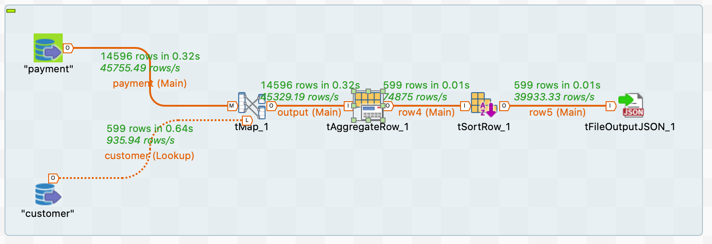

```json

```

## Exercise 7

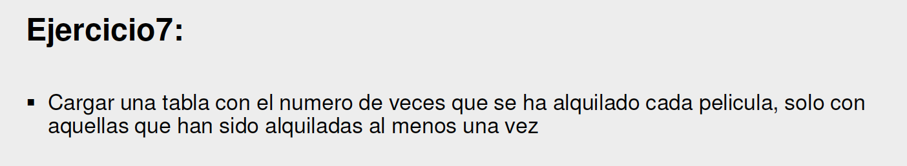

### Solution

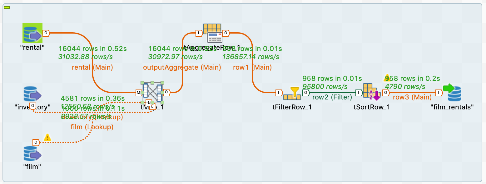

```json

```

## Exercise 8

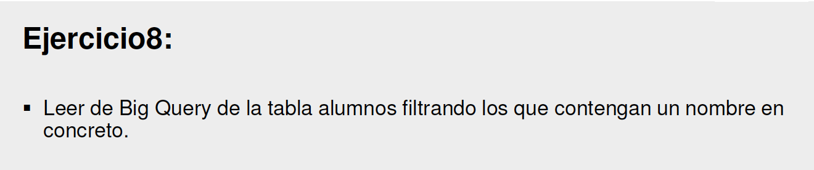

### Solution

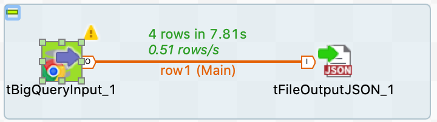

```json

```