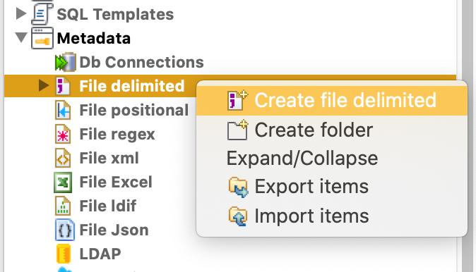

# ETL Exercise

## Exercise 1


### Solution

### Read csv file: ALUMNOS.csv



### Select and configure tFileOutputJson component


### Final job


### Output JSON: Sol1.json

[Sol1.json](Solutions/Sol1.json)

## Exercise 2


### Read csv file: Ex2.csv


### Select and configure tReplace component


### Select and configure tFileOutputJson component


### Final job


### Output JSON: Sol2.json

[Sol2.json](Solutions/Sol2.json)

## Exercise 3


### Connect to postgres db dvdrental

https://youtu.be/3tF_6JGIsuA

Add connection


Configure connection


Add schemas


#### Select actor table

https://youtu.be/aQlD-KURSlc


#### Select and configure tFileOutputJson component


#### Final job


#### Output JSON: Sol3.json

[Sol3.json](Solutions/Sol3.json)

## Exercise 4


### Solution


```json

```

## Exercise 5


### Solution


```json

```

## Exercise 6


### Solution


```json

```

## Exercise 7


### Solution


```json

```

## Exercise 8


### Solution


```json

```