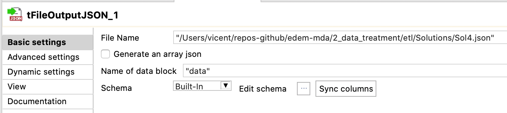

# ETL Exercise

## Load the database created in the SQL session

1) Navigate to the path where the sql docker compose file is

2) Run the following command:

`docker-compose up -d`

## Exercise 1

### Solution

#### Read csv file: ALUMNOS.csv

#### Select and configure tFileOutputJson component

#### Final job

#### Output JSON: Sol1.json

[Sol1.json](Solutions/Sol1.json)

## Exercise 2

### Solution

#### Read csv file: Ex2.csv

#### Select and configure tReplace component

#### Select and configure tFileOutputJson component

#### Final job

#### Output JSON: Sol2.json

[Sol2.json](Solutions/Sol2.json)

## Exercise 3

### Solution

#### Connect to postgres db dvdrental

https://youtu.be/3tF_6JGIsuA

Add connection

Configure connection

Add schemas

#### Select actor table

https://youtu.be/aQlD-KURSlc

#### Select and configure tFileOutputJson component

#### Final job

#### Output JSON: Sol3.json

[Sol3.json](Solutions/Sol3.json)

## Exercise 4

### Solution

https://youtu.be/nKF2fxJYfc4

#### Select film table

#### Add and configure tAggregateRow

#### Select and configure tFileOutputJson component

#### Final job

#### Output JSON: Sol4.json

[Sol4.json](Solutions/Sol4.json)

## Exercise 5

### Solution

https://youtu.be/RsZqWlDTHmY

#### Final job

#### Output JSON: Sol5.json

[Sol5.json](Solutions/sol5.json)

## Exercise 6

### Solution

https://youtu.be/vqox4KDe_0I

#### Final job

#### Output JSON: Sol6.json

[Sol6.json](Solutions/Sol6.json)

## Exercise 7

### Solution

https://youtu.be/RsZqWlDTHmY

#### Final job

#### Output JSON: Sol7.json

[Sol7.json](Solutions/Sol7.json)

## Exercise 8

### Solution

https://youtu.be/RsZqWlDTHmY

#### Final job

#### Output JSON: Sol8.json

[Sol8.json](Solutions/Sol8.json)