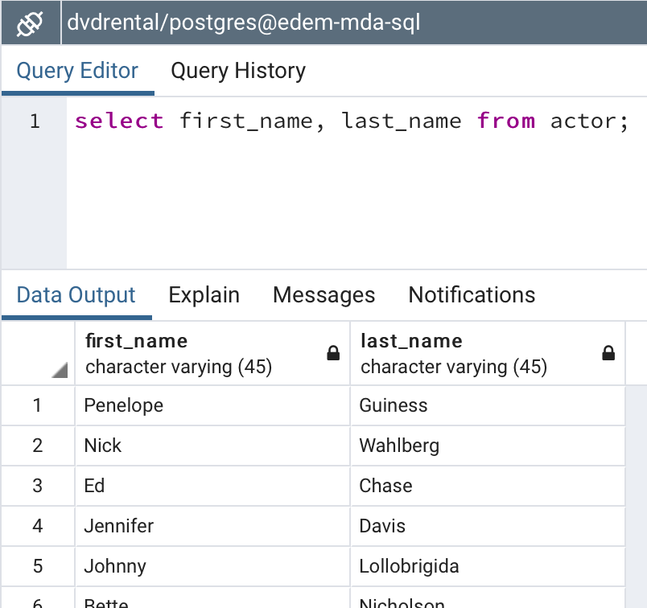
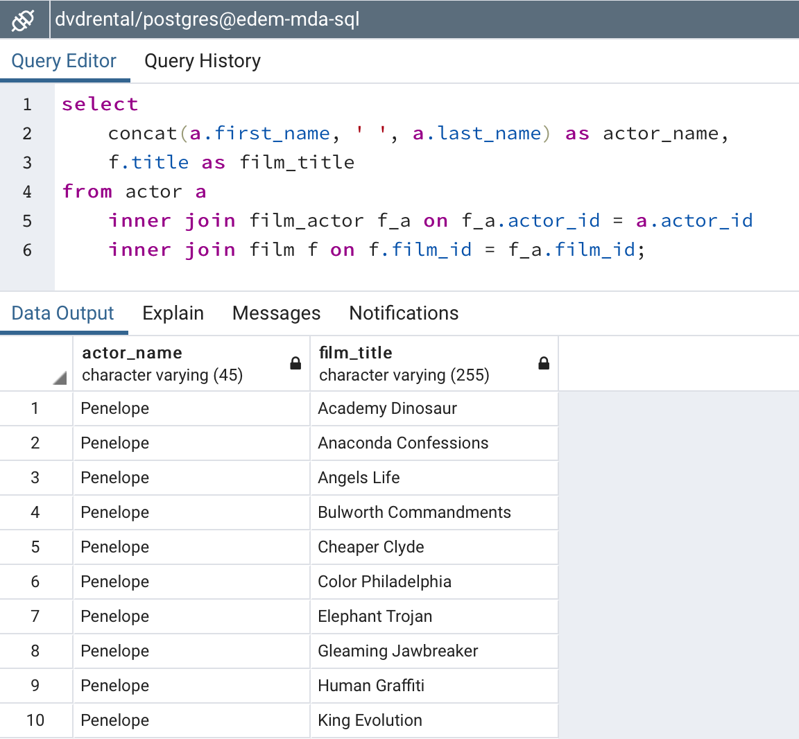
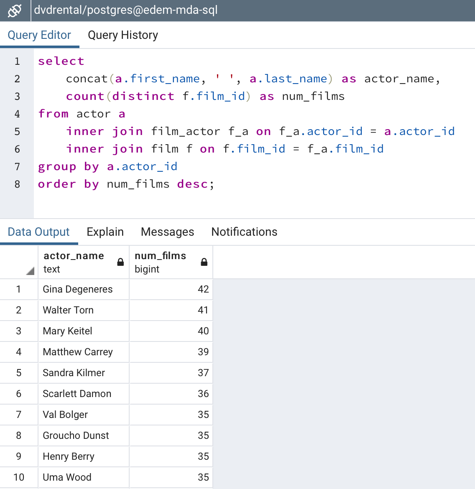
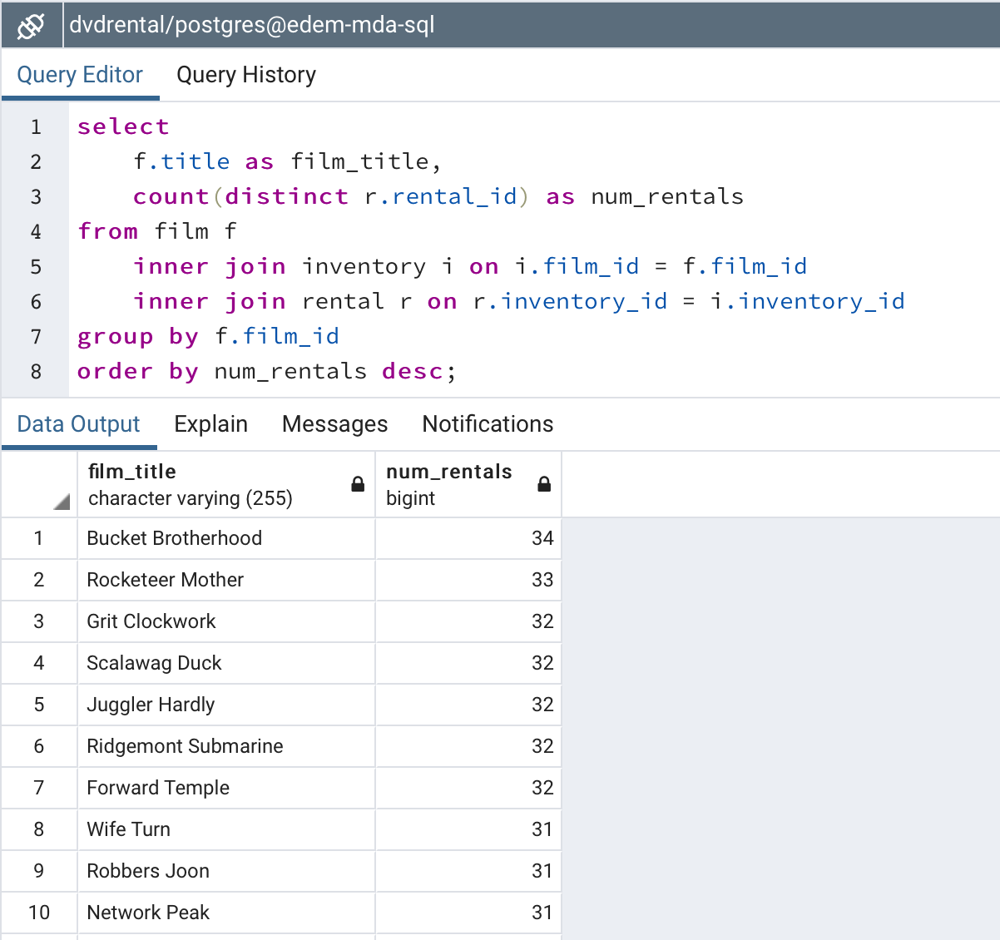
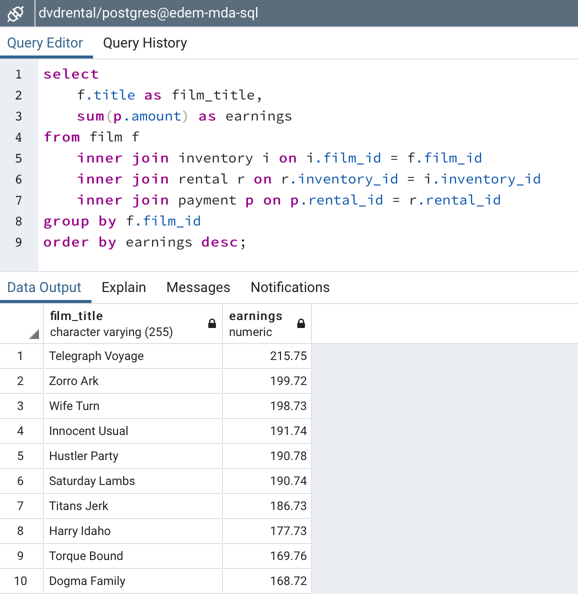
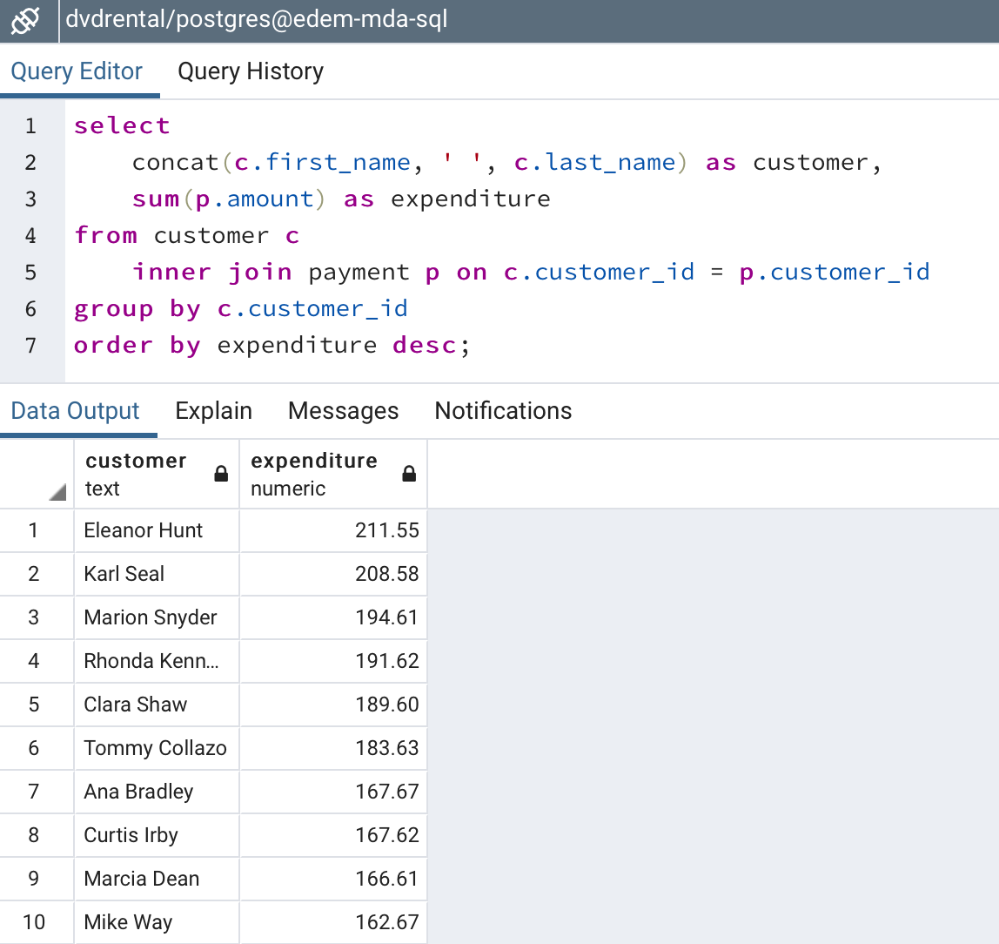
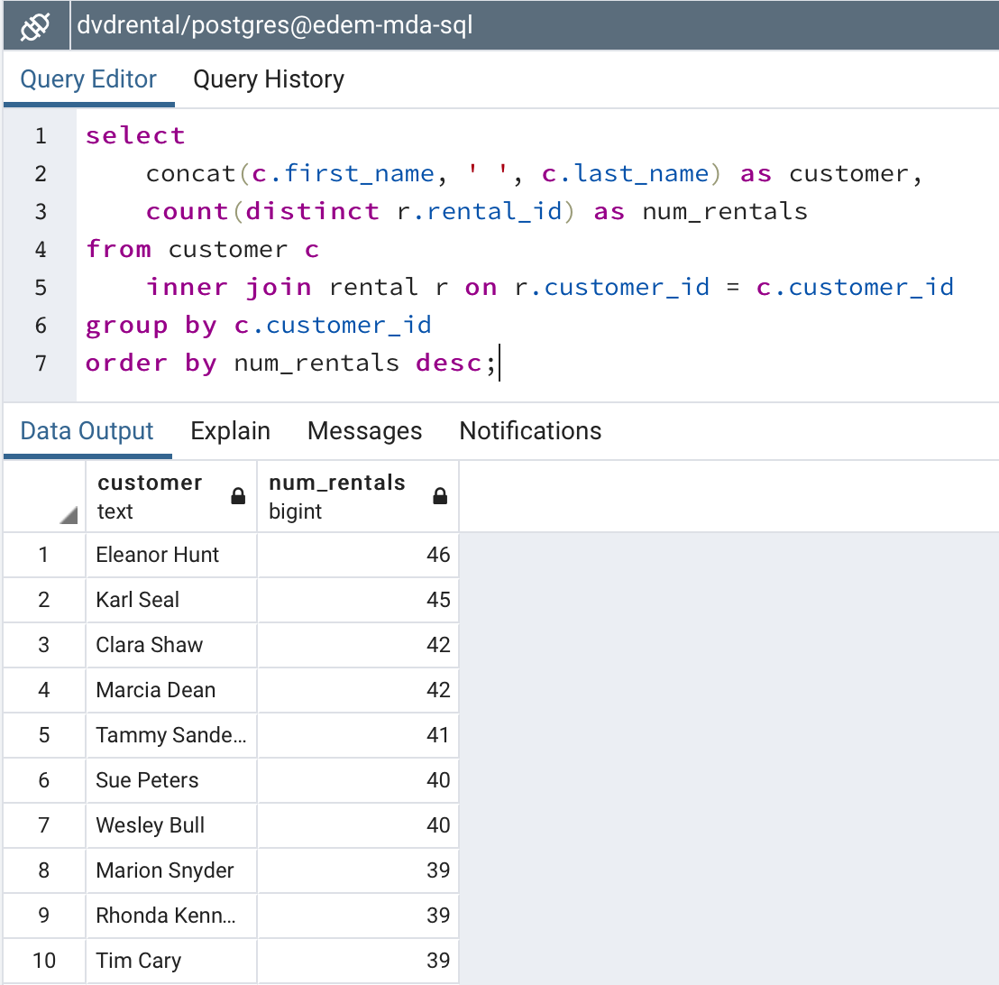

# SQL Exercise

## Author

[Pedro Nieto](https://github.com/a10pepo)

[Original Repo](https://github.com/a10pepo/edem2021/tree/master/Sesiones/sql_etl)

Modified and solved by [me](https://github.com/viasmo1)

## Create and load the database

Please follow this instructions to create your own database in local:

1) Git pull my repository

2) Navigate to the path where the docker compose file is:

3) Once in this folder run the following command:

`docker-compose up`

4) Navigate to localhost:5050 (pgadmin4@pgadmin.org / admin)

5) Create a new server with this config:

*Host: postgres*

*Port: 5432*

*Username: postgres*

*Password: Welcome01*

6) Create a database with name: **dvdrental**

7) Database Restore from File **dvdrental/dvdrental.tar**


## Exercises

### Exercise 1


#### Solution

```sql
select first_name, last_name from actor;
```



### Exercise 2


#### Solution

```sql
select 
	concat(a.first_name, ' ', a.last_name) as actor_name,
	f.title as film_title
from actor a
	inner join film_actor f_a on f_a.actor_id = a.actor_id
	inner join film f on f.film_id = f_a.film_id;
```



### Exercise 3


#### Solution

```sql
select 
	concat(a.first_name, ' ', a.last_name) as actor_name,
	count(distinct f.film_id) as num_films
from actor a
	inner join film_actor f_a on f_a.actor_id = a.actor_id
	inner join film f on f.film_id = f_a.film_id
group by a.actor_id
order by num_films desc;
```
!


### Exercise 4


#### Solution

```sql
select 
	f.title as film_title,
	count(distinct r.rental_id) as num_rentals
from film f
	inner join inventory i on i.film_id = f.film_id
	inner join rental r on r.inventory_id = i.inventory_id
group by f.film_id
order by num_rentals desc;
```



### Exercise 5


#### Solution

```sql
select 
	f.title as film_title,
	sum(p.amount) as earnings
from film f
	inner join inventory i on i.film_id = f.film_id
	inner join rental r on r.inventory_id = i.inventory_id
	inner join payment p on p.rental_id = r.rental_id
group by f.film_id
order by earnings desc;
```



### Exercise 6


#### Solution

```sql
select 
	concat(c.first_name, ' ', c.last_name) as customer,
	sum(p.amount) as expenditure
from customer c
	inner join payment p on c.customer_id = p.customer_id
group by c.customer_id
order by expenditure desc;
```



### Exercise 7


#### Solution

```sql
select 
	concat(c.first_name, ' ', c.last_name) as customer,
	count(distinct r.rental_id) as num_rentals
from customer c
	inner join rental r on r.customer_id = c.customer_id
group by c.customer_id
order by num_rentals desc;
```


