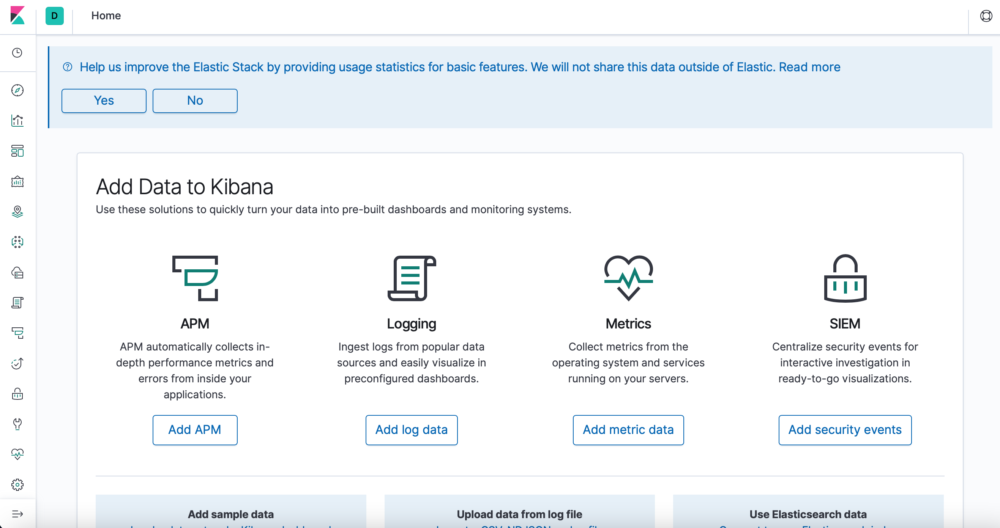
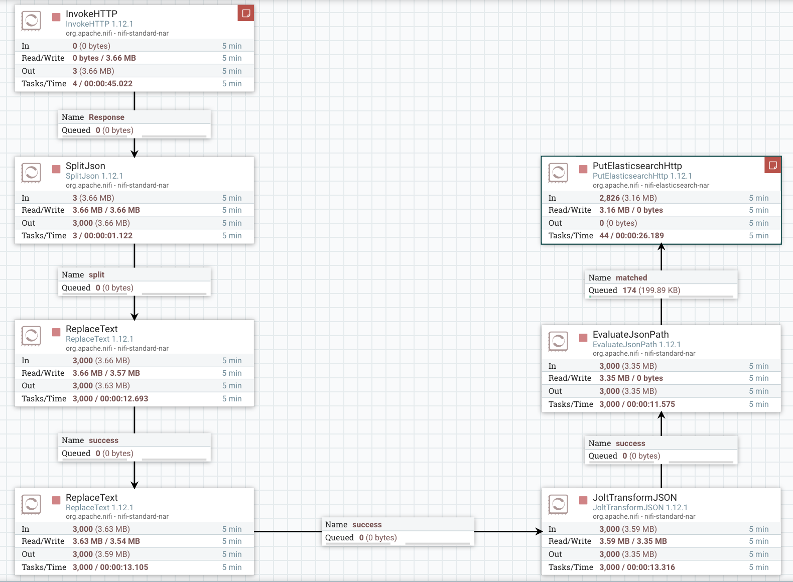
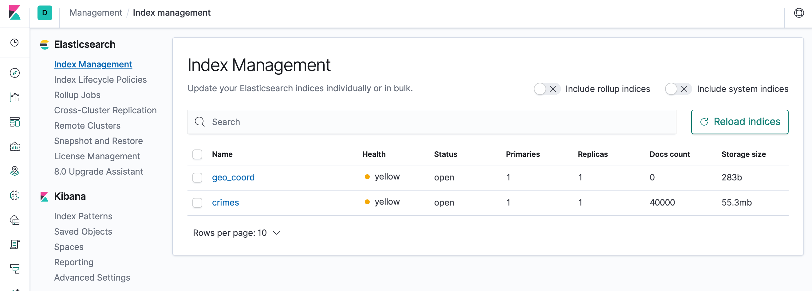

# Exercise Nifi + ELK

## Objective

Using Nifi + ELK, represent a solution that shows in a map the crimes location of the following API:

https://data.cityofnewyork.us/Social-Services/311-Service-Requests-from-2010-to-Present/erm2-nwe9

 * Content of the json response: [json](content.json)

## Solution

### Running the docker-compose

* Run the docker compose file with Nifi, Elasticsearch and Kibana:

    ```sh
    docker-compose up -d
    ```

* Open the browser and check that all three containers are running:

    * Nifi: http://localhost:8080/nifi

        

    * Elasticsearch: http://localhost:9200

        

    * Kibana: http://localhost:5601

        


### Dealing with the geo_point

* In Kibana, create the index *crimes* and map the *location* property with a geo_point data type:

    

* As explained in the elasticsearch docs, the [geo_point](https://www.elastic.co/guide/en/elasticsearch/reference/current/geo-point.html) has to have an specific format. In this case, we will use the first one, a dictionary with the following structure:

    ```sh
    {
        "location": { 
            "lat": 41.12,
            "lon": -71.34
        }
    }
    ```

    * The *location* property in the [json](content.json) returned by the API has the following structure:

        ```sh
        {
            "location": { 
                "latitude": 41.12,
                "longitude": -71.34,
                "human_address": "{\"address\": \"\", \"city\": \"\", \"state\": \"\", \"zip\": \"\"}"
            }
        }
        ```

        Thus, we need to modify it with Nifi so that we get the structure required for the geo_point.


### Nifi fileflow



| Processor | Usage |
| --- | --- |
| InvokeHTTP | Connect to the API and gets the dataset |
| SplitJSON | Splits the returned JSON into JSON docs |
| ReplaceText | Replaces "latitude" for "lat" |
| ReplaceText | Replaces "longitude" for "lon" |
| JoltTransformJSON | Removes the "human_address" property inside "location" |
| PutElasticsearchHTTP | Uploads the resultings docs into Elasticsearch |

* Configuration:

    * InvokeHTTP (scheduling time = 60seconds):

                

    * SplitJSON:

         

    * ReplaceText 1:

         

    * ReplaceText 2:

         

    * JoltTransformJSON ([web with interesting examples](https://community.cloudera.com/t5/Community-Articles/Jolt-quick-reference-for-Nifi-Jolt-Processors/ta-p/244350)):

         

    * PutElasticsearchHTTP:

        
         

### Visualizing NYC crimes data with Kibana

* Check that the docs have been uploaded into the index *crimes*. For that, we go into **Index Management** in Kibana.

    

* Create an Index Pattern for the *crimes* index.

    

* Create a new *Coordinate Map* visualization with the *crimes* index pattern and configure it as follows:

    * Metrics: *Unique count* of *unique_key*
    * Buckets: *Geo hash* of *location*

    


**THAT'S IT! WE CAN NOW START ANALYZING OUR VISUALIZATION!**